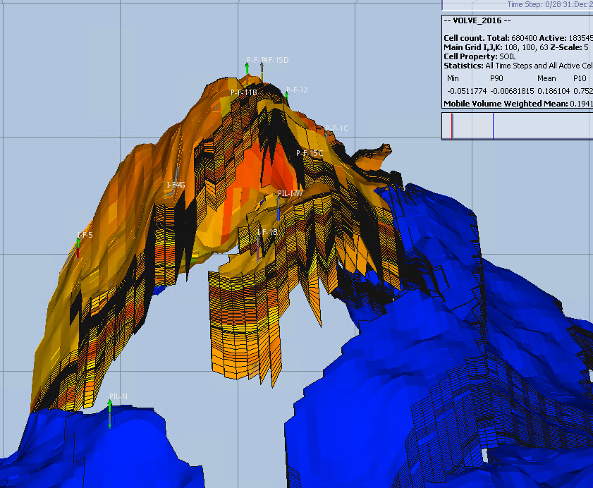
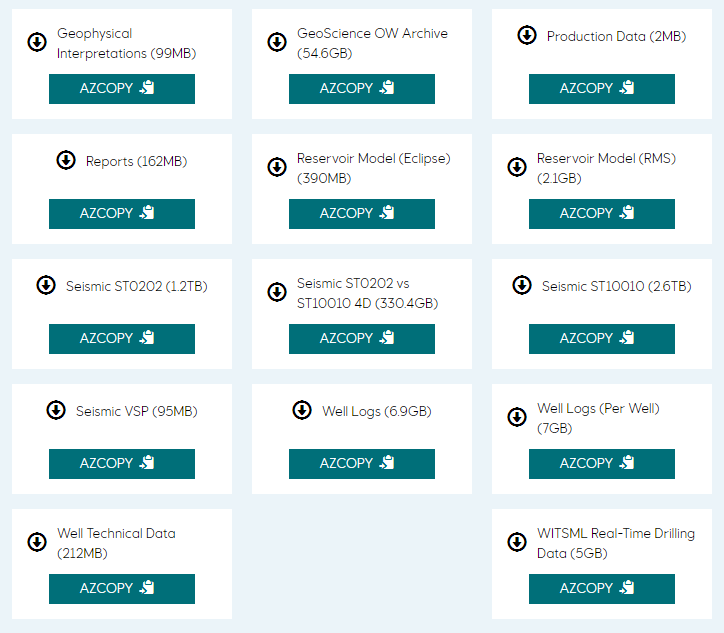
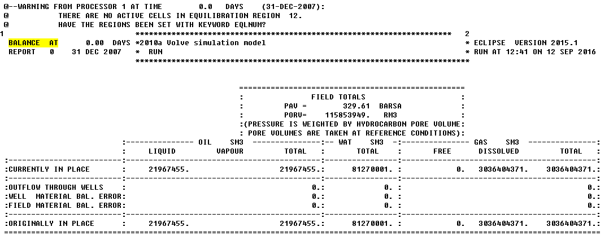
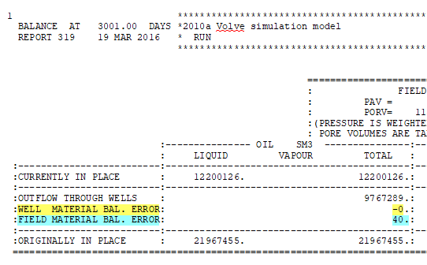
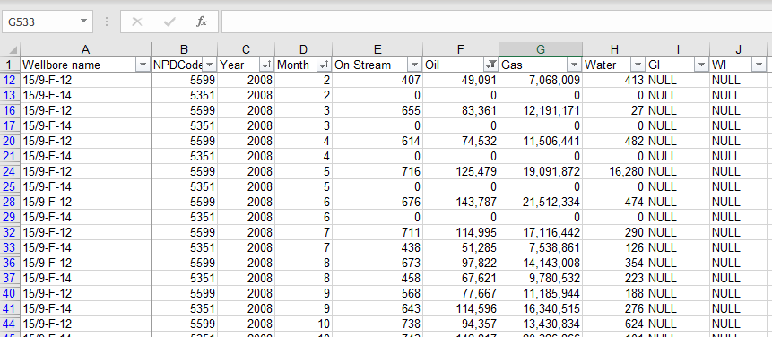

Reservoir history matching with the Volve dataset
================

<!-- README.md is generated from README.Rmd. Please edit that file -->

# Introduction

History matching is one of the core activities performed by petroleum
engineers to decrease the uncertainty of reservoir models. By comparing
real data -production data gathered at the surface-, with the output
from a reservoir simulator, the engineer starts filling in the gaps in
reservoir properties of those block cells in the model.

And this what makes it so interesting in data science, and ultimately,
in the fabrication or construction of an artificial intelligence agent.
Why? Because it represents the confluence of a reservoir model -physics
based-, and real world data, the production history. Don’t get me wrong
here\! It is not data science versus physics or engineering. It is about
transforming data in a better instrument to improve the quality of the
output of the model.

I cannot think of a better example right now to start proving an
intelligent agent for reservoir history matching. There is plenty of
literature; there are some real and synthetic reservoir models which
have been subject of machine learning algorithms extensively in SPE
papers. Very good papers indeed. With the only drawback that they cannot
be reproduced. The process or algorithm cannot be reproduced outside the
original environment in which it was written, or by any other than the
original author.

What about if we try a different approach: given that is has been proven
that history matching works by introducing machine learning algorithms
in the process, let’s pick one or some of them, and try recreating the
data science workflow step-by-step: from the raw data (production
history and reservoir model output), up to the automatic comparison of
the model with the new proposed reservoir data. The workflow should be
publicly available so other petroleum engineers could pick up where it
is and improving it for their environment setting. In other words, we
will work on making a reproducible example of a reservoir history
matching process.

And what better than using a reservoir model already given it to us for
free? I am talking about the Volve
dataset.



# Motivation

For some months now I’ve been reading about applications of machine
learning and artificial intelligence for petroleum engineering. There is
quite interesting literature in papers - I wrote a quick statistic on
the subject of data science, ML and AI that can be found in SPE papers
few weeks ago.

Be forewarned though. This will be a common obstacle you will find:
although there is a good stream of papers on ML and AI in OnePetro, one
of the things those papers are lacking is reproducibility. From
approximately 1,000 papers, maybe less than 5 have data, code and report
accompanying the paper. At this crossroads of intelligent machines, it
looks to me like a major crisis in the petroleum industry.

There cannot be **data science** without **reproducibility**; and much
less machine learning or artificial intelligence without data science.
In your understanding, how the word “science” comes to be part of “data
science”? Or, what are the inherent characteristics of a science that
data science must adopt to be called a science? Or what makes
reproducibility a key part of data science?

# Artificial Intelligence agent workflow

Artificial intelligence agents are essentially a product of computer
science, math and statistics. There is no magic in it; it just very
hard. A bit of a science as well as an art. You can say it is just a new
way of coding using data as the raw material for making a machine learn
from data. Then, applying an algorithm, or set of algorithms, to make
this process cyclical to improve its accuracy with each succesive
iteration.

How do we get to this point?

Let’s start first with a simple flow everyday text diagram:

  - A reservoir model has still some unknowns in its properties
  - We have a workflow to perform history matching but it is manual, it
    takes a long time, requires interruption to enter new data or
    updating it, it could be prone to error when copy-pasting data, it
    is boring because it needs babysitting during the whole process, and
    is heartbreaking because if the production history doesn’t match the
    reservoir simulation output we have to start all over.
  - We have production history -rates and cumulatives-, that is
    available every week or at the end of month.
  - The output of the reservoir model is yet far from matching the real
    production data
  - The reservoir simulation may take hours or days to run, or it
    engaged in another task.

What can we do different to make this matching process learning from
data?

I will be making an attempt of building a high level step-by-step recipe
based on the reading of relevant papers:

1.  Use a reservoir simulation software to generate a series of outputs
    at different reservoir properties values within practical range
2.  Extract data from the simulation reports, specifically, production
    data, rates and cumulatives.
3.  Create a rectangular dataset based on the production output from the
    simulator and the reservoir properties that were generated as inputs
4.  Correlate the reservoir cells to each of those random generated
    reservoir properties. Enter x, y, z coordinates for cell and
    property, as well as well id, area or zone, layer, thickness, etc.
    Think of it as creating a unique address for each reservoir cell
    which you will be assigning a new reservoir property.
5.  The reservoir property could be permeability, porosity, saturation,
    tranmissibility, or any other property that is still unknown. It may
    be a good idea when you are starting that you practice varying one
    property at a time. Let’s say permeability, and see how adjusting
    this property improves the accuracy of your reservoir model. Then,
    once you get the hang of it, continue adding complexity to the
    model.
6.  For every set of changes that you make on the reservoir model you
    will run the simulator to obtain a corresponding output set: a
    simulation run. It is this report from where you will be extracting
    the synthetic production data for your dataset.
7.  The dataset is the data source that the machine learning algorithm
    will use to match synthetic production against real production. The
    algorithm could be any ML algorithm that you find the best RMSE
    (Root Mean Squared Error) - the lowest the better.
8.  You may find scenarios in which a combination of reservoir
    properties yields more than one match. Here we will have to use an
    optimization method to pick the best combination.
9.  Once we obtain an acceptable set of reservoir properties these are
    entered in the reservoir model for testing. Extract the output from
    the reservoir simulator and compare against the production history.
10. Repeat this process after new production data becomes available.
11. You will find after some runs of this workflow that it could be
    automated. You will have to identify the parts in the workflow that
    are harder to automate or less dependant of supervision. In
    parallel, several algorithms will have to be identified at critical
    steps of the process. There is no one algorithm that will do it all.

# First steps: the Volve reservoir dataset

Last year Equinor release a huge dataset for the [Volve
field](https://www.equinor.com/en/news/14jun2018-disclosing-volve-data.html).
Many terabytes of data, approximately 4298 gigabytes of it.

``` r
# megabytes
cat(sprintf("Megabytes\n"))
#> Megabytes
(mega <- c(geophysics = 99, reservoir_eclipse = 390, well_technical = 212,
          seismic_vsp = 95, production = 2, reports = 162))
#>        geophysics reservoir_eclipse    well_technical       seismic_vsp 
#>                99               390               212                95 
#>        production           reports 
#>                 2               162

# gigabytes
cat(sprintf("Gigabytes\n"))
#> Gigabytes
(giga <- c(geoscience = 54.6, reservoir_rms = 2.1, well_logs = 6.9, 
          seismic_4d = 330.4, well_logs_per_well = 7, witsml_drilling = 5))
#>         geoscience      reservoir_rms          well_logs 
#>               54.6                2.1                6.9 
#>         seismic_4d well_logs_per_well    witsml_drilling 
#>              330.4                7.0                5.0

# terabytes
cat(sprintf("Terabytes\n"))
#> Terabytes
(tera <- c(seismic_st10010 = 2.6, seismic_st0202 = 1.2))
#> seismic_st10010  seismic_st0202 
#>             2.6             1.2

# Summary
cat(sprintf("\nDataset in GB\n"))
#> 
#> Dataset in GB
c(mega / 1024, giga, tera * 1024)
#>         geophysics  reservoir_eclipse     well_technical 
#>       9.667969e-02       3.808594e-01       2.070312e-01 
#>        seismic_vsp         production            reports 
#>       9.277344e-02       1.953125e-03       1.582031e-01 
#>         geoscience      reservoir_rms          well_logs 
#>       5.460000e+01       2.100000e+00       6.900000e+00 
#>         seismic_4d well_logs_per_well    witsml_drilling 
#>       3.304000e+02       7.000000e+00       5.000000e+00 
#>    seismic_st10010     seismic_st0202 
#>       2.662400e+03       1.228800e+03

giga_total <- sum(c(mega / 1024, giga, tera * 1024))

# how many gigabytes of data?
cat(sprintf("\nTotal Gigabytes: %8.3f", giga_total))
#> 
#> Total Gigabytes: 4298.137
```

For the reservoir simulation part we’ve got 399 megabytes of compressed
data, or 1.58 gigabytes of uncompressed files. Most of the files are
text files but there are few that are in binary. Text files are easy to
access and somewhat difficult to read as structured data. On the other
hand, binary files are difficult to read if you don’t know the proper
reading format but they come in more structured form.

You may want to sign up for access to the website and download the data
files [here](https://data.equinor.com/dataset/Volve). Here is a
screenshot to the datasets available. Pay special attention to the sizes
of the compressed files. The seismic files are
gigantic.

``` r

```


I downloaded the datasets using Azure Explorer, a Microsoft utility that
makes the download process almost painless. You can download the
software
[here](https://docs.microsoft.com/en-us/azure/storage/common/storage-use-azcopy?toc=%2Fazure%2Fstorage%2Ffiles%2Ftoc.json).

## The Volve reservoir X-files

From all the files in the reservoir dataset, I will pay particular
attention to the `VOLVE_2016.PRT` file. It is a 233 MB file containing
the output of the reservoir simulation.

Volve is a field that ended production in 2016 producing for
approximately 8.5 years. So, we won’t be doing the history matching with
new production history data; we will be using production data from 2008
through 2016. The reservoir model is 108 by 100 by 63 cells. From the
680,400 cells only 183,545 are active. Volves has an Oil Originally in
Place (OOIP) of approximately 22 MM m3.

Working with the output of the reservoir simulation is part of a larger
process in our path to create an artificial intelligent agent. Let’s
start by defining what the goals are:

  - Read the synthetic production data from the reservoir simulation
    output
  - Extract the rates and cumulatives-, and put them in a rectangular
    dataset, in other words, let’s save the data in a dataframe.
  - Once the synthetic production data is ready, it is time to read the
    data from the real production history.
  - Transform and convert the data to the same units and similar time
    steps.
  - Compare the synthetic data vs the real production data.
  - Observe the differences and evaluate if you have a match.

### Read the production data from the reservoir simulator

As we mentioned earlier, we will be reading the data from the output
file from the reservoir simulator. This is an output of an Eclipse
software.

It will take few seconds to read since it is a 228 megabytes file.

``` r
library(dplyr)

# read the Eclipse report
proj_root <- rprojroot::find_rstudio_root_file()
volve_2016_prt <- file.path(proj_root, "inst/rawdata", "VOLVE_2016.PRT")

volve_2016_txt <- readLines(volve_2016_prt)
```

There is one set of data we are interested in: the cumulative production
data. This data can be located in the report by using the find tool in
the text editor searching for the keyword `BALANCE
AT`.

``` r

```


What we will be reading are the following variables:

  - days: elapse days since the start of the simulation.
  - date: date in the simulation
  - oil currently in place (ocip)
  - oil originally in place (ooip)
  - gas currently in place (gcip)
  - gas originally in place (goip)

<!-- end list -->

``` r
library(dplyr)

# find the rows where we find the word "BALANCE  AT"
balance_rows <- grep("^.*BALANCE  AT", volve_2016_txt)

# add rows ahead to where the word BALANCE AT was found
field_totals_range <- lapply(seq_along(balance_rows), function(x) 
    c(balance_rows[x], balance_rows[x]+1:21))

# try different strategy
# iterating through the report pages in FIELD TOTALS
# get:
#    days, oil currently in place, oil originally in place, 
#    oil outflow through wells

# get the text from all pages and put them in a list
field_totals_report_txt <- lapply(seq_along(field_totals_range), function(x) 
    volve_2016_txt[field_totals_range[[x]]])

# iterate through the list of pages
field_totals_dfs <- lapply(seq_along(field_totals_report_txt), function(x) {
    page <- field_totals_report_txt[[x]]  # put all pages text in a list
    days_row_txt <- page[1] # get 1st row of page
    days_value <- sub(".*?(\\d+.\\d.)+.*", "\\1", days_row_txt) # extract the days
    # get the date
    date_row_txt <- grep("^.*REPORT", page)
    date_value <- sub(".*?(\\d{1,2} [A-Z]{3} \\d{4})+.*", "\\1", page[date_row_txt])
    # get oil currently in place
    ocip_row_txt <- grep("^.*:CURRENTLY IN PLACE", page)
    ocip_value <- sub(".*?(\\d+.)+.*", "\\1", page[ocip_row_txt])
    # get OOIP
    ooip_row_txt <- grep("^.*:ORIGINALLY IN PLACE", page)
    ooip_value <- sub(".*?(\\d+.)+.*", "\\1", page[ooip_row_txt])
    # get total fluid outflow through wells
    otw_row_txt <- grep("^.*:OUTFLOW THROUGH WELLS", page) # row index at this line
    otw_group_pattern <- ".*?(\\d+.)+.*?(\\d+.)+.*?(\\d+.)+.*"  # groups
    oil_otw_value <- sub(otw_group_pattern, "\\1", page[otw_row_txt]) # get oil outflow
    wat_otw_value <- sub(otw_group_pattern, "\\2", page[otw_row_txt]) # get gas outflow
    gas_otw_value <- sub(otw_group_pattern, "\\3", page[otw_row_txt]) # get water
    # get pressure
    pav_row_txt <- grep("PAV =", page)
    pav_value <- sub(".*?(\\d+.\\d.)+.*", "\\1", page[pav_row_txt])
    # dataframe
    data.frame(date = date_value, days = as.double(days_value), 
               ocip = as.double(ocip_value), 
               ooip = as.double(ooip_value), 
               oil_otw = as.double(oil_otw_value),
               wat_otw = as.double(wat_otw_value),
               gas_otw = as.double(gas_otw_value), 
               pav = as.double(pav_value),
               stringsAsFactors = FALSE
               ) 
})

field_totals <- do.call("rbind", field_totals_dfs)
```

The first 20 rows of the field totals:

``` r
head(field_totals, 20)
#>           date days     ocip     ooip oil_otw wat_otw  gas_otw    pav
#> 1  31 DEC 2007    0 21967455 21967455       0       0        0 329.61
#> 2  11 JAN 2008   11 21967456 21967455       0       0        0 329.61
#> 3  21 JAN 2008   21 21967455 21967455       0       0        0 329.62
#> 4  31 JAN 2008   31 21967454 21967455       0       0        0 329.63
#> 5  10 FEB 2008   41 21967454 21967455       0       0        0 329.64
#> 6  20 FEB 2008   51 21948189 21967455   19265       0  3055593 325.21
#> 7  26 FEB 2008   57 21936614 21967455   30840       0  4884638 322.63
#> 8   1 MAR 2008   61 21925419 21967455   42035       0  6650055 320.17
#> 9  11 MAR 2008   71 21897024 21967455   70430       0 11113293 314.17
#> 10 21 MAR 2008   81 21867231 21967455  100223       1 15777548 308.19
#> 11 31 MAR 2008   91 21846585 21967455  120869       1 19001704 304.49
#> 12 10 APR 2008  101 21817273 21967455  150181       1 23563796 298.99
#> 13 20 APR 2008  111 21795112 21967455  172342       1 27005099 295.18
#> 14 30 APR 2008  121 21772752 21967455  194702   22293 30471061 294.70
#> 15 10 MAY 2008  131 21741263 21967455  226192   89687 35337576 298.77
#> 16 20 MAY 2008  141 21698683 21967455  268771  161434 41894741 300.71
#> 17 30 MAY 2008  151 21648557 21967455  318898  234843 49587013 301.08
#> 18  9 JUN 2008  161 21610378 21967455  357076  288185 55430780 300.98
#> 19 14 JUN 2008  166 21585522 21967455  381932  320326 59229491 300.51
#> 20 19 JUN 2008  171 21560660 21967455  406794  352466 63026777 300.03
```

The last 20 rows of the field totals:

``` r
tail(field_totals, 20)
#>            date days     ocip     ooip oil_otw  wat_otw    gas_otw    pav
#> 321 29 MAR 2016 3011 12181421 21967455 9785994 14198114 1417928545 349.91
#> 322  8 APR 2016 3021 12164717 21967455 9802698 14217140 1420232722 348.84
#> 323 18 APR 2016 3031 12153329 21967455 9814086 14234562 1421789915 349.92
#> 324 28 APR 2016 3041 12142007 21967455 9825409 14246722 1423322825 350.02
#> 325  8 MAY 2016 3051 12127765 21967455 9839651 14268714 1425224327 351.06
#> 326 18 MAY 2016 3061 12114127 21967455 9853289 14288573 1427051569 351.74
#> 327 28 MAY 2016 3071 12101342 21967455 9866074 14307475 1428768955 352.40
#> 328  7 JUN 2016 3081 12088900 21967455 9878516 14328689 1430440619 353.67
#> 329 17 JUN 2016 3091 12076650 21967455 9890766 14345647 1432084650 353.93
#> 330 27 JUN 2016 3101 12063894 21967455 9903522 14364372 1433799645 354.38
#> 331  7 JLY 2016 3111 12051464 21967455 9915952 14383013 1435470706 354.87
#> 332 17 JLY 2016 3121 12041291 21967455 9926125 14394426 1436827839 354.47
#> 333 27 JLY 2016 3131 12032706 21967455 9934710 14414844 1437967246 356.80
#> 334  6 AUG 2016 3141 12023387 21967455 9944030 14419367 1439202780 355.01
#> 335 16 AUG 2016 3151 12014776 21967455 9952640 14436777 1440336643 356.54
#> 336 26 AUG 2016 3161 12007032 21967455 9960384 14451239 1441338719 357.65
#> 337  5 SEP 2016 3171 11999150 21967455 9968267 14440062 1442360056 352.55
#> 338 15 SEP 2016 3181 11990860 21967455 9976556 14413503 1443430344 343.93
#> 339 20 SEP 2016 3186 11986597 21967455 9980819 14400379 1443979050 339.76
#> 340  1 OCT 2016 3197 11986597 21967455 9980819 14400379 1443979050 341.68
```

#### Oil produced from the simulator

Since Eclipse is giving us the oil cumulative through time in the
variables `ocip`, `ooip` (which is the same throughout the field life),
`oil_otw`, the last row of the dataframe will be the cumulative
production at the end of life of the field. To get the last row, we use
the function `tail()`. Then, we subtract the `OOIP` from the `OCIP` (oil
currently in place) and `OOTW` (oil outflow through wells).

``` r
# extract the last row of the dataframe
last_row <- tail(field_totals, 1)
last_row$ooip - (last_row$ocip + last_row$oil_otw)
#> [1] 39
```

``` r
ooip_last <- last_row$ooip     # Oil Originally in Place
ocip_last <- last_row$ocip     # Oil Currently in Place (remaining)
ootw_last <- last_row$oil_otw  # Oil Outflow through Wells (produced)
```

If all the simulator output is correct, the OOIP should be equal to the
sum of the OCIP and the OOTW.

``` r
ooip_last - (ocip_last + ootw_last)
#> [1] 39
```

We get a difference of **39 cubic meters**. An error of
1.775353610^{-6}. Probably due to two reasons: rounding and the fact
that I am not considered two columns for the well and field **material
balance error**, as shown in the following
picture.



## Read the production history

Now it’s time to move our focus to the real historical production.

In the case of Volve, for produciton history we have an Excel file:
`Volve production data.xlsx`. This file is a 2.3 MB and is located
inside the `Volve_Production_data.zip` file. It is rather small in
comparison to the reservoir modeling files, the static model and the
seismic files. The file has two tab sheets: `Daily Production Data` and
`Monthly Production Data`.

The daily production data seems to be very operational, detailed data
with information about the choke size, wellhead pressure and
temperature, downhole pressure, and daily volumes of oil , gas and
water, besides the well type (producer or injector.)

The second sheet is a more concise report, much like an oil
**accounting** report. It only shows oil, gas and water cumulatives per
month. This is the data I will be talking about here, and the data that
I will be using to compare against the results from the reservoir
model.



> Note. This is the only time I use Excel, by the way.

### Open the historical production

``` r
library(xlsx)   # library to read Excel files in R

# read the Excel file
proj_root <- rprojroot::find_rstudio_root_file()   # get the project root folder
xl_file <- file.path(proj_root, "inst/rawdata", "Volve production data.xlsx")
# read only the monthly production
prod_hist <- read.xlsx(xl_file, sheetName = "Monthly Production Data") 
```

``` r
dim(prod_hist)
#> [1] 529  10
```

``` r
names(prod_hist)
#>  [1] "Wellbore.name" "NPDCode"       "Year"          "Month"        
#>  [5] "On.Stream"     "Oil"           "Gas"           "Water"        
#>  [9] "GI"            "WI"
```

``` r
str(prod_hist)
#> 'data.frame':    529 obs. of  10 variables:
#>  $ Wellbore.name: Factor w/ 7 levels "15/9-F-1 C","15/9-F-11",..: 6 7 6 7 6 7 6 7 6 7 ...
#>  $ NPDCode      : num  5693 5769 5693 5769 5693 ...
#>  $ Year         : num  2007 2007 2007 2007 2007 ...
#>  $ Month        : num  9 9 10 10 11 11 12 12 1 1 ...
#>  $ On.Stream    : Factor w/ 427 levels "0","112.91514",..: 427 427 427 427 427 427 427 427 1 1 ...
#>  $ Oil          : Factor w/ 303 levels "0","10037080.61",..: 302 302 302 302 302 302 302 302 302 302 ...
#>  $ Gas          : Factor w/ 303 levels "0","10073534.35",..: 302 302 302 302 302 302 302 302 302 302 ...
#>  $ Water        : Factor w/ 290 levels "0","100254.94",..: 289 289 289 289 289 289 289 289 289 289 ...
#>  $ GI           : Factor w/ 2 levels "NULL","Sm3": 1 1 1 1 1 1 1 1 1 1 ...
#>  $ WI           : Factor w/ 198 levels "0","104818.54778",..: 197 197 197 197 197 197 197 197 197 197 ...
```

``` r
library(dplyr)

prod_hist2 <- 
prod_hist %>% 
    mutate(oil = as.character(Oil)) %>% 
    mutate(oil = as.double(oil)) %>% 
    na.omit(oil) 
    
oil_by_well <- 
prod_hist2 %>% 
    group_by(Wellbore.name) %>%
    summarise(cum_oil = sum(oil)) %>% 
    print()
#> # A tibble: 6 x 2
#>   Wellbore.name  cum_oil
#>   <fct>            <dbl>
#> 1 15/9-F-1 C     177709.
#> 2 15/9-F-11     1147849.
#> 3 15/9-F-12     4579610.
#> 4 15/9-F-14     3942233.
#> 5 15/9-F-15 D    148519.
#> 6 15/9-F-5        41161.
```

``` r
# summarize oil production by year
oil_by_year <- 
prod_hist2 %>% 
    group_by(Year) %>%
    summarise(cum_oil = sum(oil)) %>% 
    print()
#> # A tibble: 9 x 2
#>    Year  cum_oil
#>   <dbl>    <dbl>
#> 1  2008 1764375.
#> 2  2009 2684392.
#> 3  2010 1689903.
#> 4  2011  847965.
#> 5  2012  574206.
#> 6  2013  558013.
#> 7  2014  743107.
#> 8  2015  861749.
#> 9  2016  313370.
```

``` r
library(scales)
# calculate the cumulative oil production 
(cum_oil_prod_hist_by_year <- sum(oil_by_year$cum_oil))
#> [1] 10037081
```

Summing up the cumulative oil by year we get 10,037,081 sm3.

``` r

(cum_oil_prod_hist_by_well <- sum(oil_by_well$cum_oil))
#> [1] 10037081
```

We do the same thing but from other cumlulative, oil by well: 10,037,081
sm3.

# Comparing the simulator output vs production history

FInally, we compare the simulator output against the production history.

``` r
(ootw_field_total <- tail(field_totals$oil_otw, 1))
#> [1] 9980819
```

From the simulator `PRT` file, we get 9,980,819 sm3.

From above, the cumulative production history is 10,037,081 sm3. If we
subtract both cumulatives, we get 56,262
sm3.

``` r
format(round(dif_sim_prod_hist <- (sum(oil_by_well$cum_oil) - tail(field_totals$oil_otw, 1)) / tail(field_totals$oil_otw, 1) * 100, 3), nsmall=1)
#> [1] "0.564"
```

This would be a difference of 0.564 percent. Not bad at all\!

# Conclusions

  - The Volve dataset was extraordinarily well matched for its 8.5 years
    of productive life.

  - A lot of data was fed into the Volve reservoir model. In addition to
    the `VOLVE_2016.DATA`, these additional files are supplied to the
    model: faults, contacts, permeabilities at specific blocks in the
    reservoir, irreducible water saturations, update PVT, etc.

<!-- end list -->

    GRID_postF1B_Nov2013_locupd_12112013.grdecl
    ACTNUM_2013
    FAULT_NW_NEG.GRDECL
    PHIF_NW
    KLOGH_NW
    PERMZ_NW
    UH-perm-corr-main-mod13
    FLUXNUM_2013
    FAULT_NW-15NOV13.GRDECL
    CONTACT_MAIN-NW-AP2014.GRDECL
    FAULT_MAIN-F14-AP2014.GRDECL
    FAULT_MAIN-F12-F14-AP2014.GRDECL
    UH-Upflank-NW-perm-corr
    pvt_input_new_combined_PVDG_020610_perch_water_2914m.E100
    SOF3_NEW_PESS_2TABLES.INCL
    SWFN_NEW_PESS_C15_2TABLES.INCL
    SWIRR_NW
    pp03_SORW
    pp03_KRW
    PVTNUM_2013
    FIPNUM_2013
    EQLNUM_2013
    FIPNUM13_REMOVAL
    RSVD_input_new_combined_020610_perch_water_2914m.E100
    WELL_WSEG_TRACER_HK3_MA.SUMMARY
    MOD2013_VOLVE_HM_NTRANS_BASE-SHUT-DEF-F11-BHP-F12-3.SCH
    MOD2010_VOLVE_AMAP2012_WELLS_IOR_N_UPPERHUGIN_L-F15D.SCH
    MOD2013_VOLVE_NW-OPTIONS-SHUT-PF1C_H.SCH
    i_f5_7_ju.ecl
    F-12_NOV_10_TEST_2.Ecl
    SCH_010916_10DAYS.SCH

  - The Volve reservoir model produced 9’980,819 m3 of oil for 3,197
    days. The cumulative oil from historical production was 10’037,081
    m3.

  - The Eclipse file used as a source was `VOLVE_2016.PRT`, a text file.
    We used R and regular expressions to extract the field total balance
    (OOIP, OCIP and OOTW) at different steps.

  - No additional simulation runs were performed on the Volve reservoir
    model. The model output `VOLVE_2016.PRT` was analyzed “as-is”, which
    means we found it as part of the Volve dataset and was kept
    untouched as **raw data**.

  - All the files of the Volve reservoir simulation are complete and are
    able to run if so desired using Eclipse.

# What’s Next

The fabrication or construction of an artificial intelligence agent has
started with the analysis of the original reservoir model. We found it
quite acceptable. We may say that we have gotten ourselves a **“truth”**
reservoir model.

There is a fair amount of literature on reservoir model history matching
using machine learning and artificial intelligence, including papers and
thesis. We haven’t found a single reproducible example of a start-to-end
reservoir matching using any of these techniques.

We will attempt, with the contribution of the community, a **fully
reproducible** reservoir matching process, using principles of data
science, for the construction of an artificial intelligence agent.

This is a preliminary set of steps for the continuation of such process:

  - Pick reservoir properties we are required to vary in the reservoir
    model for verification or dissipation of uncertainty.

  - Measure the impact on uncertainty of selected reservoir variables.
    This could be tied up to the importance criteria of each of the
    variables.

  - Prepare a diagram of sensitivities of the model to changes in
    reservoir properties. I wonder if this is directly related to the
    quality of the reservoir model? Is this related on decreasing
    uncertainty? I have read that some authors refer to this as KPIs.

  - Select an adressing method for reservoir properties within the block
    cells (or streamlines). This means, if we vary a reservoir property,
    where exactly this change is occurring? In what layer, what cell,
    what well?

  - Find a graphical method to distribute the reservoir property in the
    model. It is related to the point above.

  - Create a master dataset of the reservoir model variables and the
    production history variables. This dataset will be used by any of
    the selected machine learning algorithms. We are not particularly
    selecting a-priori one algorithm over the other to be able to
    compare several of them. Although, there is a good number of papers
    that use Neural Networks for this task.

  - Is this going to be a multivariable matching? Or are we looking for
    single variable matching? We have seen in some papers that they use
    standalone neural networks per matching output variable. This could
    be watercut, oil production, GOR, gas rate, etc. The initial thought
    is using a unique algorithm for the matching of the target
    variables. At this stage may be premature to take that decision. We
    may need to partition the dataset and target variables because of
    running time.

# References

  - Agarwal, Blunt 2004. “A Streamline-Based Method for Assisted History
    Matching Applied to an Arabian Gulf Field”. SPE 84462

  - Al-Thuwaini 2006. “althuwaini20062 Innovative Approach to Assist
    History Matching Using Artificial Intelligence”. SPE 99882.

  - Anifowose 2015 “Hybrid intelligent systems in petroleum reservoir
    characterization and modeling”. J Petrol Explor Prod Technol.

  - Barker 2000. “Quantifying Uncertainty in Production Forecasts -
    Another Look at the PUNQ-S3”. SPE62925.

  - Gao 2005. “Quantifying Uncertainty for the PUNQ-S3 Problem in a
    Bayesian Setting With RML”. SPE 93324.

  - Guerillot 2017. “Uncertainty Assesment in production forecast with
    an optmial artificial neural network”. SPE-183921-MS.

  - Hajizadeh 2009. “Application of Differential Evolution as a New
    Method for Automatic History Matching”. SPE 127251.

  - Mohaghegh 2017. “Data-Driven Reservoir Modeling”. ISBN
    978-1-61399-560-0.

  - Negash, Ashwin, Elraies 2017. “Artificial Neural Network and Inverse
    Solution Method for Assisted History Matching of a Reservoir Model”.
    International Journal of Applied Engineering Research.

  - Ramgulam, Ertekin, Flemings 2007. “Utilization of Artificial Neural
    Networks in the Optimization of History Matching”. SPE 107468

  - Reis 2006. “History Matching with Artificial Neural Networks”.
    SPE-100255-MS.

  - Shahkarami 2014. “Assisted History Matching Using Pattern
    Recognition Technology”. Thesis.

  - Wang 2006. “Automatic history matching using differential evolution
    algorithm”.

  - Zangl 2011. “Holistic Workflow for Autonomous History Matching using
    Intelligent Agents”. SPE 143842.

  - Zubarev 2009. “Pros and Cons of applying proxy models as substitute
    of full reservoir simulations”.
